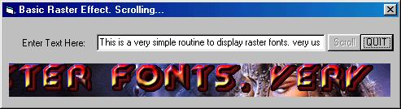



## Raster Fonts \(uploaded code\)

### Description

Basic routine to draw raster text. See screen shot. Enjoy. Reports wil be aprecciated.x
 
### More Info
 

             |
---                |---
**Submitted On**   |2003-01-23 10:04:02
**By**             |[John Ripper](https://github.com/Planet-Source-Code/PSCIndex/blob/master/ByAuthor/john-ripper.md)
**Level**          |Beginner
**User Rating**    |4.8 (24 globes from 5 users)
**Compatibility**  |VB 4\.0 \(32\-bit\), VB 5\.0, VB 6\.0
**Category**       |[Graphics](https://github.com/Planet-Source-Code/PSCIndex/blob/master/ByCategory/graphics__1-46.md)
**World**          |[Visual Basic](https://github.com/Planet-Source-Code/PSCIndex/blob/master/ByWorld/visual-basic.md)
**Archive File**   |[Raster\_Fon1533711232003\.zip](https://github.com/Planet-Source-Code/john-ripper-raster-fonts-uploaded-code__1-42666/archive/master.zip)

### API Declarations

BitBlt API

